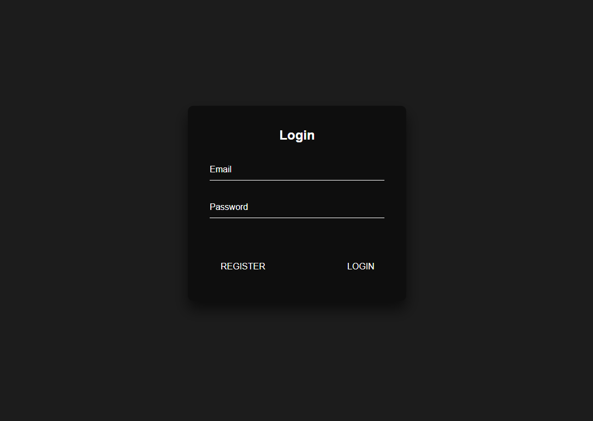

<!-- PROJECT LOGO -->
<br />
<p align="center">
  <a href="https://github.com/sanjaysunil/Firebase-Login">
    
  </a>

  <h1 align="center">Firebase Login Portal</h1>

  <p align="center">
    Authentication made easy with firebase.
    <br />
    <br />
    <a href="https://github.com/sanjaysunil/Firebase-login/issues/new?assignees=&labels=Bug&template=bug_report.md&title=%5BBUG%5D">Report Bug</a>
    ·
    <a href="https://github.com/sanjaysunil/Firebase-login/issues/new?assignees=&labels=Suggestions&template=suggestions.md&title=%5BSUGGESTION%5D">Request Feature</a>
    </p>
</p>

<!-- TABLE OF CONTENTS -->

## Table of Contents

- [About the Project](#about-the-project)
- [Features](#features)
- [Installation](#installation)
- [Roadmap](#roadmap)
- [Contributing](#contributing)
- [License](#license)
- [Built With](#built-with)
- [Contact](#contact)

<!-- ABOUT THE PROJECT -->

## About The Project



**Firebase** is a great platform which allows you to create authentication using passwords, phone numbers and other popular providers. This project allows you to register an account, verify your email and login to your account.

## Features

**Current Features:**

- Email Login
- Email Registration
- Dashboard

**Coming Soon:**

- Reset Password

## Installation

1. Clone the repo

```sh
git clone https://github.com/sanjaysunil/Firebase-Login
```

2. Open `index.html` and start using Firebase!

<!-- ROADMAP -->

## Roadmap

See the [open issues](https://github.com/sanjaysunil/firebase-login/issues) for a list of proposed features (and known issues).

<!-- CONTRIBUTING -->

## Contributing

Contributions are what make the open source community such an amazing place to be learn, inspire, and create. Any contributions you make are **greatly appreciated**.

1. Fork the Project
2. Create your Feature Branch (`git checkout -b feature/AmazingFeature`)
3. Commit your Changes (`git commit -m 'Add some AmazingFeature'`)
4. Push to the Branch (`git push origin feature/AmazingFeature`)
5. Open a Pull Request

<!-- LICENSE -->

## License

Distributed under the MIT License. See `LICENSE` for more information.
